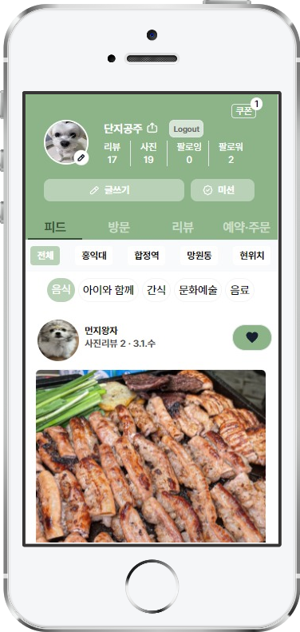
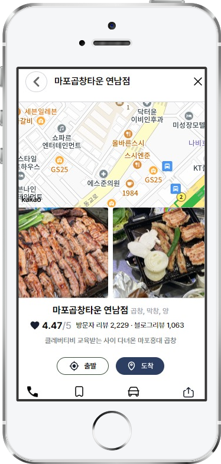
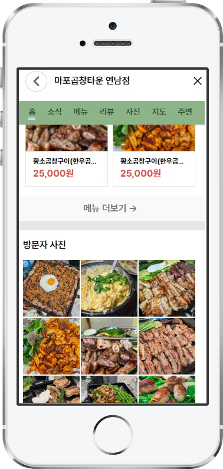
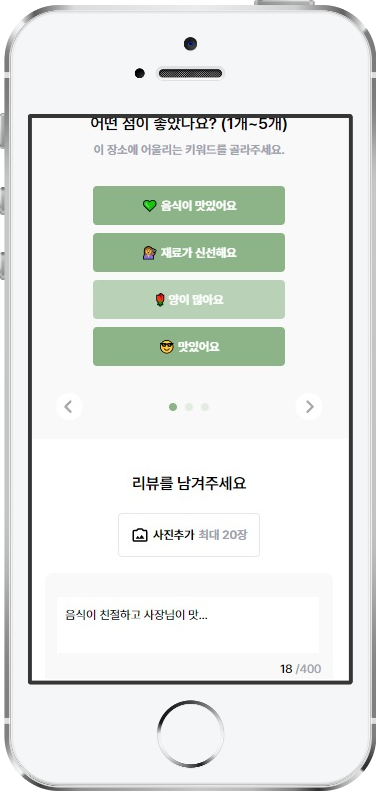
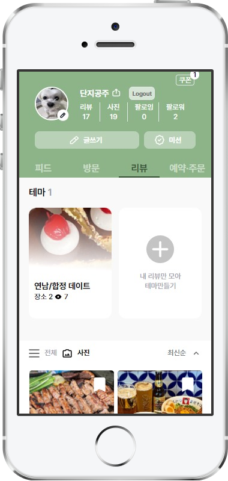
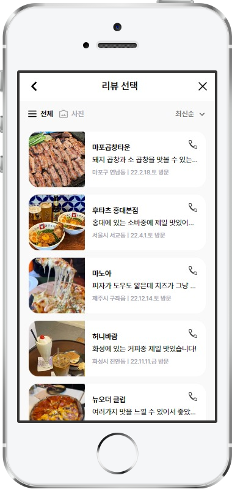
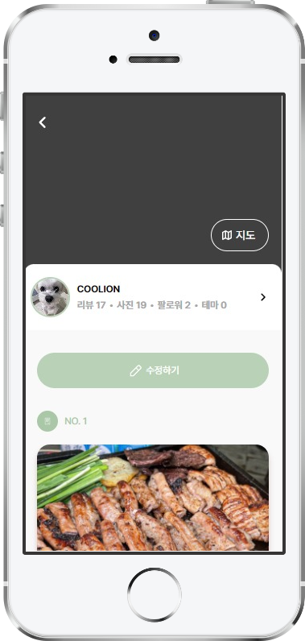
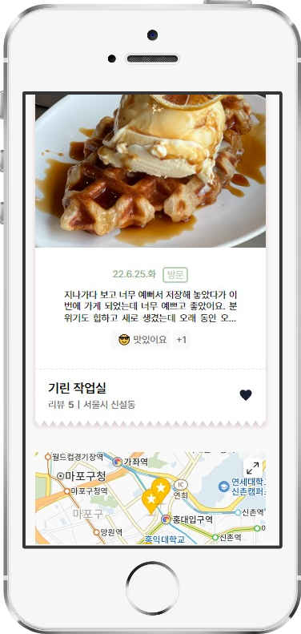

# Lion Place (mobile)

- [Lion Place (mobile)](#lion-place-mobile)
  - [프로젝트 소개](#프로젝트-소개)
  - [참여 인원 및 담당 페이지](#참여-인원-및-담당-페이지)
  - [기술 스택](#기술-스택)
    - 
    - [화면 플로우](#화면-플로우)
    - [프로젝트 마무리 후 소감](#프로젝트-마무리-후-소감)

## 프로젝트 소개
  [테킷 멋쟁이 사자처럼] 프론트엔드 스쿨 6기에서 진행한 JS 프로젝트.  
  네이버 플레이스 기반으로 한 바닐라 JS 앱 만들기.  

## 참여 인원 및 담당 페이지
*[테킷 멋쟁이 사자처럼]* 프론트엔드 스쿨 6기  

| 이름 | GitHub | 담당페이지 |
|:----:|:------:|:------:|
| 박지영 | https://github.com/yxxung  | 방문 페이지, 리뷰 페이지 |
| 전선용 | https://github.com/sy0725  |  로그인 페이지, 회원가입 페이지 |
| 박지함 | https://github.com/itzwe  |  테마 생성 및 리스트 출력 페이지 |
| 강예나 | https://github.com/yenaf  |  피드 페이지, 가게 상세정보 |
| 강경민 | https://github.com/minomad  |  테마 페이지, 리뷰 선택 페이지 |

## 기술 스택

### 
    

  

### 화면 플로우  
 1. 시작 페이지
  
   

 2. 로그인 페이지
  
2-1 회원가입 페이지 (기존 가입된 아이디 말고 새로운 아이디 사용하고 싶은 경우)
 

3. 피드 페이지 (로그인 성공 시 넘어가는 페이지)

3-1 맵 페이지 (게시글 클릭 시)

<table>
<tr>
<td></td>
<td> </td>
</tr>
</table>
4. 방문기록 페이지 ( nav바 방문버튼 누를 시 이동)

4-1 리뷰쓰기 페이지 (방문기록 페이지에서 리뷰쓰기 누를 시)

5. 테마 페이지 (nav바 리뷰버튼 누를 시 이동)

5-1 전체 리뷰 페이지(테마 페이지에서 전체버튼 누를 시 이동)

1. 테마 설정 페이지 (테마 페이지 +버튼 누를 시)

6-1 테마 리스트 페이지 (테마 설정 페이지에서 등록버튼 누를 시)
<table>
<tr>
<td></td>
<td></td>
</tr>
</table>
     　　　　

### 프로젝트 마무리 후 소감
**강경민** : 바닐라 자바스크립트 프로젝트를 하면서  html, css를 JS로 제어하는 방법들을 알 수 있었고 로컬서버의 데이터를 랜더링하는 기능을 구현하면서  비동기 통신을 배울 수 있었서 좋았습니다. 팀원들 모두 열심히 참여해주셔서 재밌게 프로젝트를 진행할 수 있었습니다.

**강예나** : 어려웠지만 즐거웠고 최선을 다했습니다. 고생한 우리 15GJO 팀원들 감사드리고 수고하셨습니다. 사랑해요 십오지조~

**박지영** : 바닐라 자바스크립트로 프로젝트를 하며 기초를 다시 다질 수 있는 시간이었습니다. 팀원 모두 열정적으로 참여해주셔서 처음 설정 한 목표대로 잘 마무리할 수 있었습니다. 

**박지함** :  수업을 듣고 복습하며 이론 공부하는것에 그치지 않고 직접 프로젝트를 구현해 보는 과정에서 많은것을 배울 수 있었다. 먼저 지난 프로젝트와 달리, 깃허브 마일스톤을 통해서 팀원들과 일정 관리를 하는 과정이 현업에서 어떤 식으로 일이 진행 될 지 간략하게 나마 알 수 있어서 좋았다. 그리고 코드 내부적으로는 직접 json-server를 통해 데이터를 만들고, 데이터를 어떻게 주고 받는지 과정에 대해서 알 수 있어 흥미로웠고, api도 직접 사용해볼 수 있어서 뜻깊은 기간이였다. 그래도 가장 좋은던것은 어렵더라도 의욕을 잃지 않고 열심히 참여하고, 남을 따뜻하게 돌봐주는 팀원들을 만난게 가장 좋았다 . 

**전선용** : JS 프로젝트라 떨리고 불안했고 아쉬운 부분도 있었지만 팀원들의 따뜻한 배려로 기분좋게 마무리 할 수 있었습니다.

